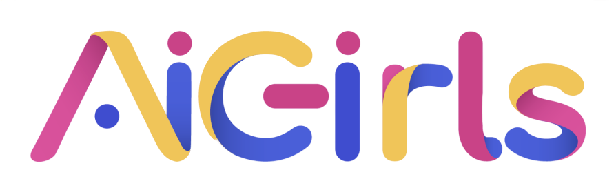

# Código de ética e conduta do AI Girls

AI Girls se dedica a fornecer uma comunidade **respeitosa e livre de assédio para todos**. Não toleramos assédio ou intimidação de qualquer membro da comunidade de qualquer forma. Isso não se estende apenas aos membros da comunidade AI Girls locais, mas a qualquer pessoa que opte por se envolver na comunidade maior de usuários, desenvolvedores e integradores AI Girls por meio de eventos ou interações. Além disso, não são permitidos compartilhamentos de conteúdo de teor unicamente político ou religioso.

O assédio inclui comentários verbais / eletrônicos ofensivos relacionados a características ou escolhas pessoais, imagens ou comentários sexuais em espaços públicos ou online, intimidação deliberada, bullying, perseguição, fotografia ou gravação de assédio, interrupção sustentada de conversas, chats, reuniões eletrônicas, físicas reuniões ou outros eventos, contato físico impróprio ou atenção sexual indesejada.

Se um participante se envolver em comportamento de assédio, representantes da comunidade podem tomar medidas razoáveis que considerem adequadas, incluindo:

* Advertir o infrator;
* Expulsão de qualquer evento do AI Girls;
* Expulsão do grupo do Telegram, fóruns de discussão e outros canais de comunicação;
* Expulsão da comunidade;

Se você estiver sendo assediada e/ou desrespeitada,  observe se outra participante também está sendo e/ou caso você identifique alguma postura que não condiga com este código de conduta, interceda ou peça ajuda a qualquer membro da comunidade AI girls, administradores do telegram, administradores de sites ou organizadores / representantes de qualquer pessoa física eventos organizados do AI Girls.

*Este código de conduta foi adaptado da comunidade [Pyladies SP](https://github.com/PyLadiesSP/codigo-de-conduta) e [Pyladies Internacional](https://pyladies.com/CodeOfConduct/)*

